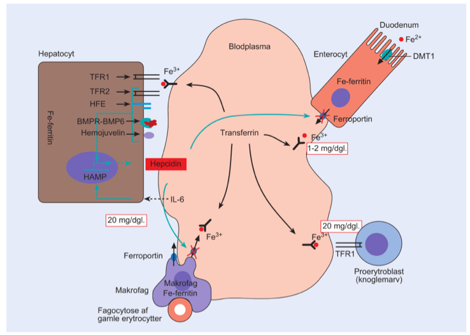
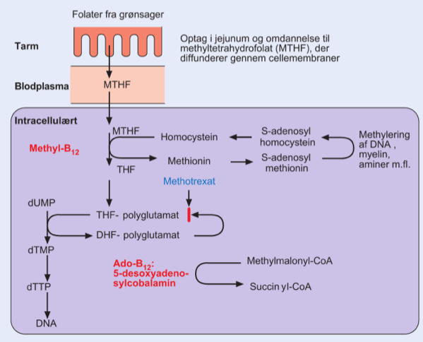
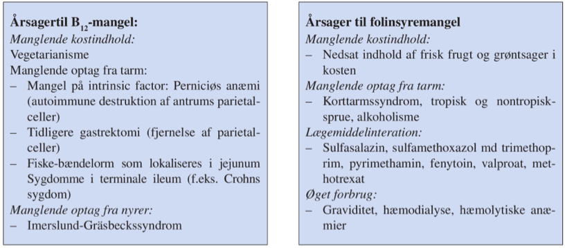
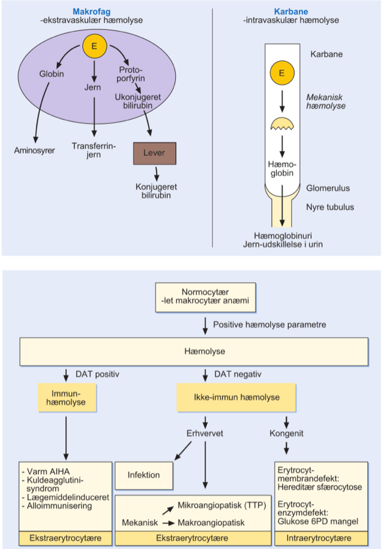

[TOC]

# Mangelanæmier `1722`

## Jernmangelanæmi

`Sideropen anæmi | anaemia sideropenica | Iron deficiency anaemia`

Hyppigste årsager er blødning (menstruation/okkult blødning).

Ses også ved vækst, graviditet, amning og menstruation.

Faldende intracellulær ferritin og P-ferritin -> faldende P-jern, stigende P-transferrin.

Generelle anæmisymptomer:

1. Bleghed (især slimhinder)
2. Træthed
3. Tachykardi

Desuden kan ses forandringer i mundhulen.

### Paraklinisk

Som man vil forvente, dog med thrombocytose (formentligt pga. EPO-stimulation).

### Diagnose

P-ferritin < 12 µg/L er patognomonisk for jernmangel.

## Anæmi ved kronisk sygdom

`Anaemia of inflammation | anaemia of chronic disease`

Skyldes enten:

1. Forøget hepcidinudtryk i leveren -> nedsat tilgængeligt jern
2. IL-1 og/eller TNF-α
3. Anden genese

P-ferritin vil i modsætning til ved jernmangel være forhøjet.

Tilgrundliggende årsag behandles, samtidigt med at der gives jern enten intramuskulært eller IV.

## Proteinmangel

Anæmi, thrombocytopeni, granulocytopeni, gelatinøs transformation af knoglemarven.

# Megaloblastære anæmier `1724`

## Vitamin B~12~-mangel

Megaloblastær anæmi og neuropati (afferente baner i medulla). 

Hypersegmentering af neutrofile granulocytter er meget karakteristisk.

### Diagnose

Nedsat P-B~12~ 

Som proxy kan bruges methylmalonat eller homocystein.

### Behandling

Anti-IF og anti-paritalcellerantistoffer

Gastroskopi for at opspore atrofisk gastritis.

## Folatmangel

`Folinsyremangel`

Samme symptomer som B~12~-mangel.

### Diagnose

Nedsat HgB

P-LDH typisk meget forhøjet.

P-folinsyre nedsat.

# Hæmolytisk anæmier `1727`

Karakteriseres ved:

1. Øget erythrocytdestruktion
   1. Forøget P-Bilirubin
   2. Forøget P-LDH
   3. Nedsat P-Haptoglobin
2. Øget produktion af erythrocytter
   1. Reticulocytose
   2. Evt. normoblaster i perifært blod

Adskilles i *immunbetingede* og *ikke-immunbeitngede* ud fra DIrekte Antiglobulin Test (DAT), der påviser autoantistoffer mod erythrocytternes membran.

## Immunbetingede hæmolyser

### Varm AIHA

`Autoimmun hæmolytisk anæmi af varmetypen | immunhæmolytisk anæmi |autoimmune haemolytic anaemia`

Ses primært > 45 år.

80-90% af de immunhæmolytisk anæmier, ~100 p.a. i DK.

Ofte ikterus.

Galdesten kan ses efter længerevarende hæmolyse.

Oftest fuldt kompenseret (B-HgB normal).

De fleste har hyperspleni.

==Lav eller find tabel med de forskellige markører for hver af anæmierne til opslag (i Evernote?)==

## Kold AIHA

`Autoimmun hæmolytisk anæmi af kuldetypen | immunhæmolytisk anæmi |autoimmune haemolytic anaemia|cold agglutinin syndrome`

Ses primært > 45 år.

Ses enten idiopatisk eller sekundært til:

1. Malignitet
2. Infektion
   1. Mycoplasma pneumoniae
   2. EBV

Forhøjet P-LDH og nedsat P-Haptoglobin.

## Lægemiddelinduceret immunbetinget hæmolytisk anæmi

## Erythrocytmembrandefekter

## Hereditær sfærocytose (HS)

`Sphaerocytosis hereditaria | Hereditary sphaerocytosis`

Kongenit, 80% autosomal dominant.

1:5.000.

==Den mest udbredte form for kongenit hæmolyse==

Stivere erythrocytvæg -> længere transittid i milt -> større hæmolyse.

### Diagnostik

Udstrygning og/eller flowcytometri (EMA).

Behandles med splenektomi.

## Hereditær elliptocytose (HE)

2.000 p.a. i DK.

## Hereditær pyropoikilocytose (HPP)

## Paraksystisk nokturn hæmoglobinuri (PNH)

`Haemoglobinuria nocturna paroxystica | paroxysmal nocturnal haemoglobinuria `

Prævalens på 10 i DK.

## Erythrocyt-enzymdefekter

### G6PD-mangel

`Glukose-6-fosfat dehydrogenase mangel`

Manglende kapacitet til at modvirke oxidativt stress – aggressiv hæmolyse ved øget oxidativt stress.

#### Diagnostik

Nedsat G6PD-aktivitet påvises. 

#### Behandling

Nedsæt omgående eksposition for oxidanter, herunder især lægemidler.

## Pyrivatkinasemangel

## Mekanisk påvirkning

### Makroangiopatisk hæmolyse

Skyldes typisk proteser, kunstige hjerteklapper eller AV-fistler.

### Mikroangiopatisk hæmolyse

For ddx se `1733`.

# Knoglemarvshypoplasi

## Aplastisk anæmi

Inddeles i grader, se `1738`.

10 p.a. i DK, ses hyppigst hos unge.

I langt de fleste tilfælde idiopatisk, kan skyldes toksiske påvirkninger (lægemidler/toxiner) eller infektioner.

Dødelig inden for måneder ubehandlet, allogen stamcelletransplantation og immunsuppressiv terapi er kurativt hos langt hovedparten.

5-årsoverlevelse på 80-90%.