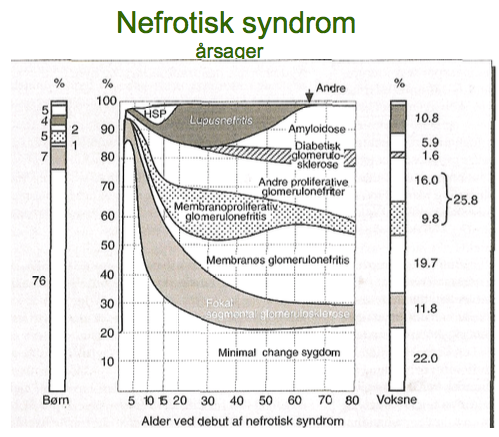

[TOC]

# Glomerulonefritis forelæsning

Hyppigste årsager se `1901`. Især:

1. Glomerulonefritis
2. DBM
3. Amyloidose

Nyrebiopsi er specielt indiceret ved:

1. Forhøjet P-kreatinin eller
2. Proteinuri > 1 g/døgn eller
3. Mistanke om systemsygdom og proteinuri/hæmaturi

Komplikationsrate 0-6%, mortalitetsrate 0-0,1%.

Minimal change giver forstørret filtration (på trods af fusion af podocytterne)
​	Forøget risiko for infektioner sekundært til:

1. Filtration af immunglobuliner
2. Behandling (steroider)

Akut vs. kronisk ved nyresvigt:

1. UL (normal nyrestørrelse?)
2. Postrenalt nyresvigt?

ANCA aktiverer neutrofile granulocytter.

OBS: Wegeners:

1. Nasopharyngealt ulcus
2. Hæmoptyse
3. Halvmåneglomerulonefritis
4. Ledsmerter (prævalens?)

Makroskopisk blod i urin hos ung mand:

1. Nyresten
2. UVI

Makroskopisk hæmaturi ved feberepisoder: Tyder på IgA-glomerulonefritis.