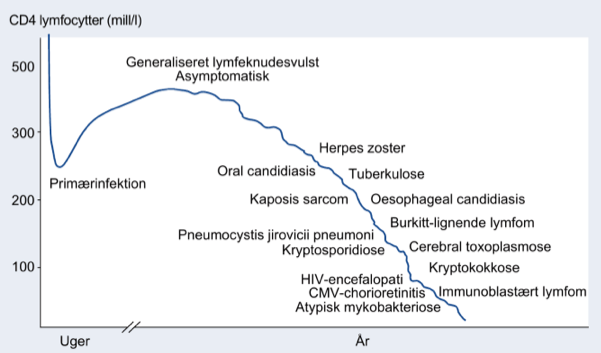

[TOC]
# HIV `748-754`

`Human Immunodeficiency Virus`

HIV er gået over i AIDS, hvis pt. har en af de AIDS-definerende sygdomme (se tabel 27.48 `748`)

Smitte blandt stofmisbrugere er _meget_ sjældent i DK.

Risiko for smitteoverførsel ved et enkelt samleje er ca. 0,2%.

Risiko for smitte fra mor til barn er ca. 25%, via amning og perinatalt.

## Symptomer

### Primærfasen

Inkubationstid 2-4 uger, op til 6 uger.

50% udvikler primærsymptomer der er mononukleose- eller influenzalignende.

- Feber (96%)
- Generaliseret lymfadenopati (74%)
- Pharyngit
- Udslet

==Se slides for %==

Varer fra få dage til flere uger, media 10 dage, selvlimiterende.

Kan mindre hyppigt give nakkestivhed (meningoencephalitis) og kranienervepareser.

### Den asymptomatiske fase

### Den symptomatiske fase

#### Luftveje

Hyppigst pnemocystis jiruvecii pneumoni.

#### Mave-tarmkanal

Hyppigst *Candida albicans.*

#### CNS og øjne

Især toxoplasma, der kan ses ved CT.

## Paraklinisk

### Primærfasen

Lymfopeni --(1 uge)--> Lymfocytose med atypiske lymfocytter

### Asymptomatiske fase

Parakliniske parametre kan være normale, ofte kan HIV-RNA påvises.

### Symptomatiske fase

Lymfopeni, lavt CD4-celletal

Desuden lav B-HgB og P-LDH.

### Forløb

Mediantiden fra smittetidspunkt til udvikling af AIDS er 8-10 år.

Overlevelse ved tidlig behandling som befolkningen i øvrigt.

## Diagnose

Antistofundersøgelse mod HIV, følsom efter 3 uger.

Ved mistænkt primærfase kan der anvendes HIV-RNA test.

## Profylakse

Undgå smitte.

Ved mistænkt smitte skal der straks tages kontakt til specialafdeling og indledes HAART (reducerer smitte fra 0,3% til 0,1%.).

## Anmeldelse

Er anmeldelsespligtigt skriftligt