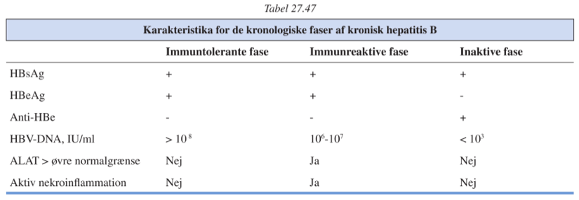

[TOC]
# Hepatitis `739-747`

`Leverbetændelse | Viral hepatitis`

## Akut virushepatitis

==Alle hepatitis-infektioner er anmeldelsespligtige==

36 tilfælde i 2011, ligeligt fordelt mellem A, B og C.

### Symptomer

Typisk meget få symptomer, især i børn.

Det klassiske symptomatiske forløb er prodromale almensymptomer i uger efterfulgt af leverspecifikke symptomer i dage (op til uger/måneder).

### Paraklinisk

Voldsomt forøgede ALAT/ASAT (>100x)

P-Basisk fosfatase let forøgede (2-3 gange).

### DDX

1. EBV
2. CMV
3. Gul feber
4. Andre årsager til leversvigt

Vil typisk afficere en lang række andre organer end leveren.

## Kronisk virushepatitis

Infektion med hepatitisvirus varende mere end 6 mdr.

## Hepatitis A

Kan give træthed i flere måneder efter infektion.

### Diagnose

ELISA mod anti-HAV IgM.

### Profylakse

Hygiejne. Husstandskontakter til pt. med smitsom Hep A bør tilbydes vaccination.

### Anmeldelse

Anmeldelsespligtig

## Hepatitis B

### Paraklinik

Kan kvantificeres med HBV-DNA.

### Diagnose

Påvisning af HBsAg og anti-HBc IgM.

### Kronisk hepatitis B

#### Den immuntolerante fase

#### Den immunreaktive fase

Uger-måneder.

#### Den inaktive fase

#### Reaktiveringsfasen

Svingende parakliniske markører.

#### Okkult kronisk hepatitis B

Negativ HBsAg.

Negativ eller svagt positiv B-HBV DNA.

Positiv HBV-DNA i lever.

### Anmeldelse

Både akut og kronisk hepatitis B er anmeldelsespligtigt.

## Hepatitis C

