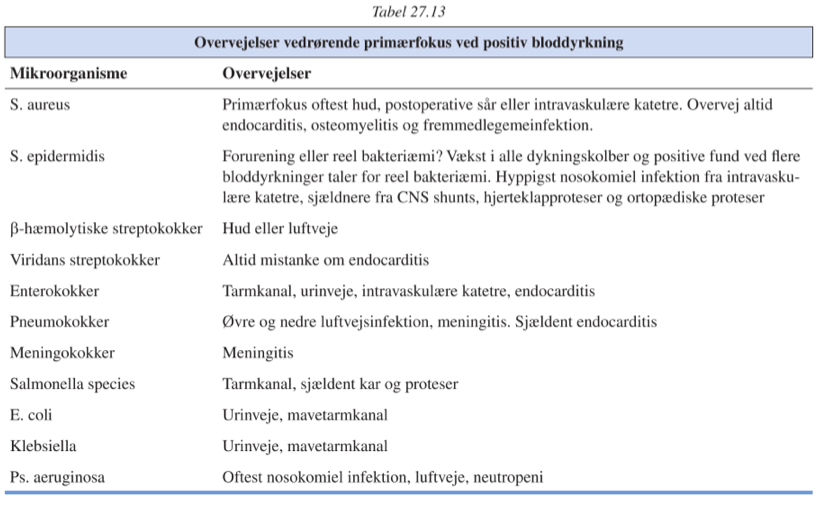
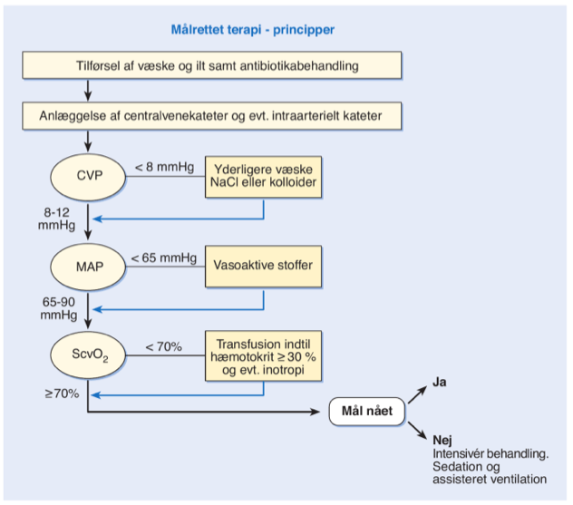

#Bakteriæmi og sepsis `626-634`

[TOC]

## Bakteriæmi
Omkring 65% er nosokomiel.

### Ætiologi
####Hyppigst:
1. E. coli
2. S. aureus
3. S. pneumonia

####Mindre hyppigt:
1. Enterobacteriaceae
2. Enterokokker
3. Andre streptokokker
4. P. aeruginosa
5. S. epidermidis
6. Meningokokker
7. Salmonella

###Hyppige primære foci
####Ekstravaskulært
1. Absces
2. Pneumoni
3. UVI

####Intravaskulært
1. Hjerteklapper
2. Katetre
3. Karproteser

####Udredning for primærfokus
Afhænger af:
1. Mikroorganismen
   2. Se tabel 27.13 `630`
2. Klinisk tilstand
3. Immunstatus
4. Infektionsfokus

Hvis der ikke er fokale syptomer eller fund skal der tages:

1. Ekkokardiografi
2. Billeddiagnostik
   3. CT-TAB
   4. Knoglescintigrafi
   5. Leukocytscintigrafi
   6. PET-CT

###Risikofaktorer
####Slimhindeskader
####Porto-systemisk shunt:
Der ses normalt bakteriæmi i v. porta, som fjernes af Kupfercellerne i leveren. Ved porto-systemiske shunts ses hyppigt gram-negativ bakteriæmi.

####Prognose
Afhænger af pt.s almentilstand, typisk 20-30 %.

####Diagnose
Definitorisk når der påvises bakterier i en bloddyrkning.
OBS: Forurening

#####Næsten altid sande patogener
1. S. pyogenes
2. S. aureus
3. S. pneumoniae
4. E. coli
5. Meningokokker
6. Salmonella

#####Almindeligvis forurening (80-90%)
1. S. epidermidis
2. S. viridans
3. Corynebakterier

####Behandling
1. Overvej kirurgisk intervention og skift af intravaskulære katetre.
2. Antibiotika IV

## Svær sepsis og septisk shock
12 pr. 1000

####Risikofaktorer
1. Diabetes mellitus
2. Levercirrose
3. Maligne blodsygdomme
4. Maligne lymfomer
5. Immunsuppresiv behandling
6. Cytostatika
7. Neonatale
8. Ældre
9. Kirurgiske indgreb
   10. Mave-tarm
   11. Galdeveje
   12. Urinveje

###Ætiologi
Typisk bakterier, nogle gange svampe, sjældent parasitter og vira.

Hos ~40% lykkes det ikke at finde agens, da antibiotisk behandling er igangsat empirisk.

####Hyppigst
1. E. coli
2. Stafylokokker
3. Pneumokokker

####Mindre hyppigt
1. Enterobacteriaceae
2. S. pyogenes
3. Enterokokker
4. Meningokokker

####Sygdomserhvervet
1. S. aureus
2. S. epidermidis
3. Enterokokker
4. Acinetobacter
5. P. aeroginosa
6. Andre pseudomonas
7. Candida

###Symptomer og klinisk fund
**Tidlige symptomer** på svær sepsis er almen sygdomsfølelse, kulderystelser, muskelsmerter, feber, kvalme, opkastninger og evt. symptomer fra et primært infektionsfokus.

**Objektivt**: Takykardi, takypnø. og tør hud.
Temperatur ofte høj eller uregelmæssigt springende, kan være normal eller lav.

Senere udvikles hypotension med bleg, kølig og cyanotisk hud.
Cerebral påvirkning og oliguri.

Videreudvikling til nyresvigt, hjertesvigt, respirationsinsufficiens (undertiden pga. ARDS), hæmorragisk diatese (DIC).

#### Specielle symptomer
#####Ikterus
Kan tyde på focus i lever, galdeveje eller pancreas – OBS: Kan også være som konsekvens af nedsat leverfunktion

#####Diaré
Hyppigst blot et tegn på intestinal iskæmi

####Paraklinisk fund
Ingen er patognomiske. Typisk:

| Værdi           | Ændring                                  |
| --------------- | ---------------------------------------- |
| Leukocytter     | Neutrofil leukocytose med venstreforskydning |
| CRP             | ↑ (↓ CRP udelukker ikke sepsis)          |
| Procalcitonin   | ↑                                        |
| pH              | Respiratorisk alkalose -> metabolisk acidose og hypoxi |
| P-laktat        | ↑                                        |
| ALAT/ASAT       | ↑                                        |
| B-HgB           | ↓                                        |
| B-Thrombocytter | ↓                                        |
| Albumin         | ↓                                        |
| Rtg. thorax:    | Bilaterale infiltrater (ARDS) el. pneumoni |

| Pt.-gruppe    | Pos.-bloddyrkning | Mortalitet[^Mortality] |
| ------------- | ----------------- | ---------------------- |
| Sepsis        | 20%               | 15%                    |
| Svær sepsis   | 35%               | 20%                    |
| Septisk shock | 60%               | 50%                    |

Monitorering af behandlingsrespons:

1. Cerebral påvirkning
2. Normalisering af centralt venetryk & stigende arterielt blodtryk
   1. Perifær hudtemperatur (↑)
   2. Timediureser (↑)

####Diagnose
Stilles klinisk, idet behandlingen ikke kan afvente svar på parakliniske undersøgelser.

Grundig anamnese og objektiv undersøgelse afgørende:

- Har pt. for nyligt været indlagt på hospital?
   - Har der været brud på hud her?
        - Har pt. fået antibiotika der kan påvirke dyrkningsresultatet?
   - Har pt. tilgrundliggende sygdom der kan forøge til sepsis?
        - Splenektomi
        - Abdominale lidelser
        - IV-stofmisbrug
        - Malnutrition
        - Stort alkoholforbrug
        - Svær neutrocytopeni
        - Hypogammaglobulinæmi
        - HIV-infektion
- Udlandsrejse?
- Tegn på primært infektionsfokus?

#####DDx:
1. Andre årsager til shock
   2. AMI
   3. Lungeemboli
   4. Blødning
   5. Anafylaksi

####Behandlingsprincipper
==Der skal altid tages materiale til dyrkning inden antibiotikabehandlingen startes.==

Behandling skal iværksættes ASAP.

1. Væske
2. Ilt
3. Empirisk behandling med antibiotika
4. Fokussanering
5. Organunderstøttende behandling

Ved manglende respons på vasopressorer:

1. Glukokortikoider

Initielle hæmodynamiske behandlingsmål:

| Parameter         | Mål                              |
| ----------------- | -------------------------------- |
| 1. CVP            | 8-12 mmHg                        |
| 2. MAP            | 65-90 mmHg (systolisk > 90 mmHg) |
| 3. $ScvO_2$[^CVS] | > 70% eller                      |
| $P_aO_2$          | > 9kPa eller                     |
| $S_aO_2$          | > 92%                            |
| 4. pH             | ±2 BE                            |
| 5. Timediurese    | > 0,5 ml/kg/time                 |

[^Mortality]: Mortalitet dog meget variabel, afhængig af almentilstand og grundsygdom.
[^CVS]: Central venøs saturation