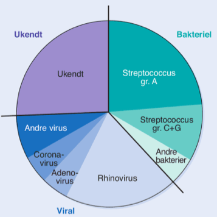
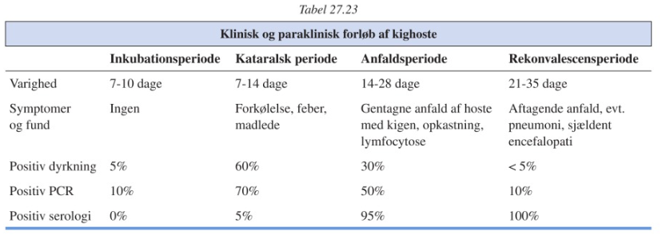
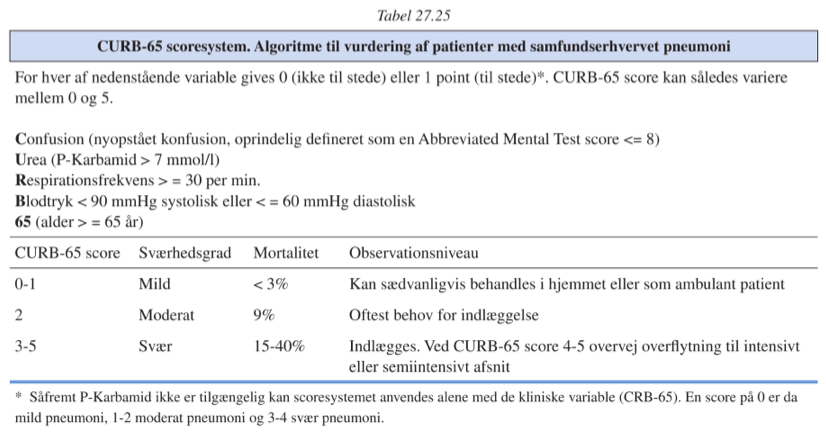
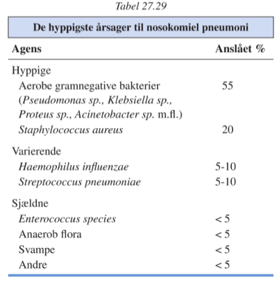
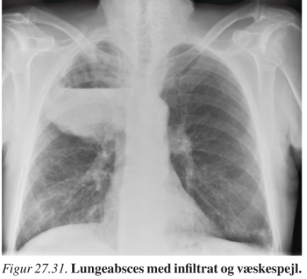

[TOC]
# Øvre luftvejsinfektioner `660-671`

Voksne rammes i gennemsnit 3 gange årligt, børn 6 gange årligt.

90% er virusbetingede.

## Forkølelse

`Snue | Common cold`

Varer typisk 7 dage, giver nedsat præstationsevne.

## Tonsillitis og pharyngitis

`Acute tonsillitis | Sore throat | Pharyngitis | Halsbetændelse`

Agens er især S. pyogenes.

Skønsmæssigt 500.000 p.a. i DK.

### Smitte

Streptokoktonsillitis smitter primært fra raske bærere. 15% af børn er raske bærere.

Der er ikke evidens for profylaktisk behandling af raske bærere.

### Symptomer

Inkubationstid 2-4 dage.

Diffus rødmen i pharynx, der kan ses belægninger og cervical lymphadenitis.

Varighed ubehandlet ~7 dage.

#### Scarlatina

Rødmen i ansigtet, der ikke rammer området mellem næse og hage. Spreder sig efter ~1 døgn til resten af kroppen, og giver ~1mm brede, røde prikker, der kan ligne gåsehud.

Efter et par dage ses karakteristisk afskalning.

##### DDX

1. Virale eksantemer
2. Toxic shock syndrom
3. Kawasakis sygdom

### Diagnostik og DDX

Diagnose skal stilles mikrobiologisk, typisk streptokok antigen test. Meget specifik, kun moderat sensitiv – ved vedvarende symptomer eller hyppige recidiver anbefales dyrkning.

Hvis mere end 2 af nedenstående optræder kan antibiotisk behandling startes umiddelbart:

1. Temperatur over 38,5° C
2. Belægninger i svælget
3. Angulær glandelsvulst
4. Fravær af snue samt hoste

**Adenovirus**: Medinddrager næse og conjunctivalslimhinderne.

**Coxsackie A**: Herpangina med vesikler, der brister og giver ulcerationer.

**Mononukleose**: Næsen tilstoppet, tonsillerne tykkere, universel lymphadenit.

**Candidiasis**: Typisk hvide belægninger.

**Vincents angina**: Ensidig ulcerøs tonsillit med få almensymptomer (evt. grågrønne belægninger)

Ud over disse er det generelt ikke muligt reelt at adskille tilfældene, hverken klinisk eller paraklinisk.

### Komplikationer

#### Bakterielle

**Lokale**: Peritonsillær absccess, lymphadenitis, otitis media, rhinitis purulenta, sinuitis

**Bakteriæmiske**: Sepsis, meningitis, osteomyelitis, artritis

#### Immunologiske

**Post-strep glomerulonefritis** `PSGN`

**Febris rheumatica** `Gigtfeber`

## Fusobacteriosis

`Lemierres syndrom | Necrobacillosis | Lemierre´s syndrome`

5-15 tilfælde p.a. i DK.

Infektion med anaerob mundhule-normalflora.

Typisk primærfokus i øvre luftveje, spreder sig parapharyngealt med involvering af jugularis interna. Spreder sig derfra vi albodbanen til lunger, pleura og led.

### Symptomer

Pharyngitis/tonsillitis med pludselig forværring af tilstanden, især unilaterale smerter og hævelse svarende til det parapharyngeale rum.

Der kan ses septisk shock og pneumonale symptomer, evt. med dæmpning og svækket respirationslyd pga. pleuraekssudat og/eller empyem.

Involvering ses hos 85%.

Mortalitet uden antibiotika op til 90%, behandlet ca. 20%.

#### Diagnose

Skal mistænkes ved pt. der præsenterer med svær sepsis, abscesser eller lungesymtpomer i forløb med halsinfektion.

Definitiv diagnose ved dyrkning af blod, pleuravæske eller mediastinalt.

## Pseudocroup

`Falsk strubehoste | Croup | Parainfluenzavirus `

Subglottisk stenosering sekundært til hævelse af stemmebåndende.

https://www.youtube.com/watch?v=P7VGxsxnJYE

Hyppigste agens er parainfluenzavirus.

Ses hyppigst hos børn i alderen 1/2 til 4 år.

Giver en stridor der primært er inspiratorisk og udvikles over **timer**.

Åndenøden kan give clavikulære indtrækninger, progredierende til anoxi og cyanose.

### Diagnose

Stilles i reglen let klinisk.

### DDX

**Epiglottitis acuta**: Ødem og ømhed af mundgulvet

**Fremmedlegemer**: Udvikles momentant, ikke initiel temperaturforøgelse

**Allergisk glottisødem**: Udvikles hurtigere.

### Behandling

Barnet skal beroliges, sidde op i et velventileret og køligt rum.

Tæt monitorering er nødvendigt, da tilstanden kan forværres pludseligt og kræve intubation. Kun de letteste tilfælde kan monitoreres i hjemmet.

Ved cyanoseanfald indlægges altid.

Ved stridor indlægges næsten altid.

Sværeste tilfælde behandles med adrenalininhalationer, evt. suppleret med inhalationssteroid.

Systemisk steroid gives i de aller sværest tilfælde.

Antibiotika er uden virkning.

## Epiglottitis acuta

`Acute epiglottitis`

Kan ses i alle aldersgrupper, hyppigst hos børn mellem 2 og 6 år.

Hypigste agens i uvaccinerede er Haemophilus Influenzae type B. Hos voksne ses ofte streptokokker.

### Symptomer

Udvikles akut i løbet af timer.

Synkesmerter, savlen, dyspnø, medtaget almentilstand og temperaturforøgelse.

Ømhed af mundbunden og larynxskelettet.

Pt. sidder foroverbøjet – her er smerterne mindst udtalte og respirationen lettest.

*Kontraindiceret* at forsøge at se epiglottis ved at trykke tungen ned med spatel uden at være klar til øjeblikkelig intubation.

### Behandling

Absolut indlæggelsesindikation, transport bør ske med lægeledsagelse.

Ofte indikation for intubation.

## Pertussis

`Kighoste | Whooping cough`

Hyppigste agens er bordatella pertussis, i mildere for bordatella parapertussis.

På trods af vaccination ca. 80 tilfælde årligt i DK hos børn under 2 år. Immuniteten er kun relativ.

5-15% af længerevarende hoste (> 2 mdr.) hos voksne skyldes pertussis.

### Smitte

5 dage efter første første eksposition til 6 uger efter anfaldenes begyndelse, selvom der stadig er anfald. Smitte kun via stuen eller inficerede pt.

Inkubationstid 7 (5-21) dage. Sjældent mere end 10 dage.

### Symptomer

### Diagnose

Stilles klinisk på de patognomiske hosteanfald, PCR kan anvendes. Serologi (som ikke er valideret i børn under 7 år) kan primært bruges til monitorering af forløbet.

Video af hosteanfaldene: https://www.youtube.com/embed/S3oZrMGDMMw

#### Paraklinisk

Der ses voldsom lymfocytose da pertussis blokerer for extravasation af lymfocytterne.

#### DDX:

1. Cystisk fibrose – brug svedtest

2. RSV-infektion

   Ved længerevarende sygdom:

3. ACE-hæmmere

4. Malign sygdom

## Influenza

`Influenza | Flu`

Kun H1-3 og N1-2 har betydning i mennesker, enkelt tilfælde med H5N1 og H7N7, H7N9 og H9N2.

Smitter kun ca. 2 døgn efter klinisk debut.

### Diagnose

Kan diagnosticeres med PCR.

Under epidemi vil det kliniske billede være diagnostisk.

### DDX

*Laryngo-trache-bronchitis* kaldes oftest populært influenza, med adskiller sig klar ved udtalte kataralsk symptomer og mindre akut begyndelse.

*Pneumonier og ornitose (C. psittaci)*: Begynder ikke så hyperakut, mere langtrukkent forløb.

### Vaccine

Generelt sikker, enkelte vacciner har været svagt associeret (incidens 1/100.000 vaccinationer) med Guillain-Barrès syndrom (polyradikulitis).

Indiceret ved:

- Ældre (> 65 år)
- Personer med kronisk sygdom, især hjerte-lunge sygdomme
- Patienter med diabetes eller immundefekt
- Sundhedspersonale

## Parotitis epidemica

`Fåresyge | Mumps`

I DK 10-30 tilfælde p.a.

Smitter via spyt, infektiøs dosis ret høj, kræver tæt kontakt.

### DDX

Parotissvulst ses også ved infektion med:

1. CMV
2. M. pneumoniae
3. Coxsackie

*Adenitis angularis*: En finger kan komme ind mellem glandlen og kæbevinklen

*Sialolithiasis*: Svulsten er intermitterende og der er ikke temperaturforhøjelse. Sten kan påvises ved sialografi.

*Sarcoidose*: Sjældent akut.

*Primære parotistumorer* og *allergisk parotissvulst*: Parotissvulsten ikke øm, varer mere end uger.

# Infektioner i nedre luftveje `671-686`

## Bronchitis acuta

`Bronkitis | Acuta bronchitis`

Formentligt flere hundrede tusinde tilfælde om året.

Hyppigste ætiologi vira (for specifikke agenser `671`), sjældnere bakterier.

Non-infektiøs akut bronchitis ses også, typisk inhalation af støv og irriterende luftarter.

### Diagnose

Stilles på det kliniske billede.

### DDX

*Pneumoni*: Typisk mere forværret almentilstand og/eller dyspnø.

*Malign lungelidelse*: Strækker sig over mere end 2 uger.

*Tuberkulose*: Strækker sig over mere end 2 uger.

*Asthma*: Mange recidiver.

### Behandling

Ingen specifik, symptomatisk.

Behandling af akut KOL-exacerbation. er beskrevet  `1289`. 

## Pneumoni `672`

`Lungebetændelse | Pneumonia`

### Samfundserhvervet pneumoni

`Pneumoni erhvervet uden for sygehus | Samfundserhvervet pneumoni | Community acquired pneumonia`

For risikofaktorer og agens, se `673`.

#### Præsentation

**Typisk pneumoni**: Adskiller sig fra influenza ved typisk at have produktiv hoste. Bliver positiv 1-3 døgn efter indsættelse.

Ved st.p. kan der findes dæmpning, bronkiale respirationslyde og krepitation.

**Atypisk pneumoni**: Sjældnere svært medtaget, st.p. normal, rtg. thorax diffuse infiltrater bilateralt.

Hverken klinisk eller paraklinisk kan der skelnes mellem atypisk og typisk pneumoni.

==OBS: Selvom legionella er en atypisk pneumoni præsenterer den sig klinisk meget voldsomt.==

#### Vurdering af sværhedsgrad – CURB-65

==Lær CURB-65 udenad.==
==OBS: Kun til samfundserhvervet pneumoni==

#### Paraklinisk

Som forventes.

Der kan ses ↑ P-LDH.

Der kan ses nedsat nyrefunktion (↑ P-kratinin og ↑ P-Karbamid) hos den mege tmedtagede pt. Er en prognostisk faktor for dårlige udfald.

Ved svær sepsis kan ses metabolisk acidose.

#### DDX

*Lungeemboli*: Sjældent høj feber eller markant leukocytose i initialfasen. Det septiske lungeinfarkt er undtagelsen.

*Lungetumor*: Rygere > 50 år bør tilbydes genundersøgelse 6-8 uger efter pneumonien.

#### Forløb

Kan have feber i 3-5 dage. Ved feber >5 dage bør pt. genvurderes:

1. Agens, der ikke er følsom for behandling
2. Tuberkulose
3. Drug fever
4. Komplikation, eg. empyem

### Mycoplasma pneumoniae

Smitter ved dråbeinfektion i miljøer med tæt kontakt; familier og skoleklasser.

Inkubationstid 2-3 uger.

Infektionen rammer primært 5-25 årige.

### Legionella pneumoni

`Legionærsyge | Legionella pneumonia | Legionnaires' disease | Pontiac fever`

Ca. 125 p.a. i DK.

#### Paraklinisk

Hos de flest pt. ses multiorganpåvirkning med:

| Markør            |      |
| ----------------- | ---- |
| P-Kreatinin       | ↑    |
| P-Na+             | ↓    |
| P-Kreatininkinase | ↑    |
| ALAT/ASAT         | ↑    |
| P-Albumin         | ↓    |

Desuden hæmaturi og proteinuri.

#### Diagnose

PCR på aspirat og/eller LUT (høj PPV, lavere NPV).

### Nocardiose

`Nocardiosis`

Smitte sker ved inhalation af jord og støv der indeholder bakterien.

Symptomer er de generelle inflammationssymptomer: Træthed, feber, nattesved og vægttab.

Ved CNS-involvering ses hovedpine, kramper og fokale neurologiske udfald.

CNS-billeddiagnostik viser absces-lignende billede.

#### Diagnose

Positivt ekspektorat, transbronchial biopsi kan være nødvendig.

Ved lokaliseret CNS-sygdom er undersøgelse af absces nødvendig.

### Actinomykose

`Actinomycosis`

Normalflora i mundhule og tarm. 

#### Symptomer

##### Cervicofacial aktinomykose

Starter uger efter tandekstration eller oralt traume.

Der ses blålig tumor på halsen eller i nakken.

##### Thoracal actinomykose

Direkte spredning fra hals eller ved aspiration; hoste, pleurasmerter og vedvarende subfebrilia.

##### Abdominal actinomykose

Efter appendektomi eller i relation til traumatisk perforation af tarmen, evt. i kvinder med spiral.

#### Diagnose

Rtg. og CT kan være til hjælp, men mikrobiologisk påvising kræves.

Agens er anaerobt -> transport til mikrobiologisk skal ske hurtigt.

### Aspirationspneumoni

Mistænkes ved pt. med pneumoni, hvor der har været bevidsthedssvækkelse; apopleksi, epilepsi, alkoholforgiftning og medikamenel forgiftning.

Nogle ældre (endog lungeraske) kan aspirere under søvn.

==Infiltrat ses typisk basalt i højre lunge.==

### Nosokomiel pneumoni

`Hospitalspneumoni | Pneumoni erhvervet på sygehus | Respiratorpneumoni | Health care associated pneumonia | Hospital acquired pneumonia | Ventilator associated pneumonia | HCAP`

==Hospitalspneumoni: Pneumoni, der udvikler sig mindst 48 timer efter indlæggelse==

==Respiratorpneumoni: Pneumoni, der udvikler sig efter mindst 48 timers respiratorbehandling==

Præsentation meget variabel da pt. kan være i behandling med antipyretika, kortikosteroider eller have svækket immunforsvar.

Dyspnø og/eller behov for ilt for at holde saturation kan være indikator.

#### DDX

**Primær hos ældre**

- *Lungeemboli*: Da rtg. thorax for nosokomiel pneumoni ofte er atypisk kan diagnostik kræve CT-thorax, lungescintigrafi eller ekkokardiografi.
- *Venstresidig hjerteinsufficiens*

**Hos alle**

* *Andre nosokomielle infektioner*.

### Viruspneumoni

Hyppigste agens:

Børn:

- RSV
- Parainfluenzavirus
- (Metapneumovirus)

Voksne:

- Influenzavirus
- Adenovirus

Pt. viser typisk kun lettere påvirkning af almentilstanden, st.p. kun lette forandringer og rtg. thorax viser kun lette fintplettede, konfluerende infiltrater.

# Intrathorakale komplikationer til pneumoni `683-686`

## Lungeabsces

2-400 p.a.

Ses hyppigt ved aspirationspneumoni og som komplikation til pneumoni hos immunsvækkede pt.

### Årsager

**Hyppigst**:

- Pneumoni
- Maligne tumorer
- Aspiration

**Sjældnere**:

* Septisk emboli
* Inficeret lungeinfarkt
* Lungetraumer med vævskontusion

### Diagnose

Skal altid bronchoskoperes for at udelukke malign tumor.

## Pleuraempyen

`Empyema pleurae | Kronisk lungehindebetændelse | Pleural empyema`

### Årsager

- Komplikation til pneumoni
- Komplikation til lungeabsces
- Øsofagusruptur
- Subfrenisk absces

Biokemiske markører og agens for ekssudatet kan ses på `684`.

### Diagnose

Pleurapunktur med anaerob og aerob dyrkning.

