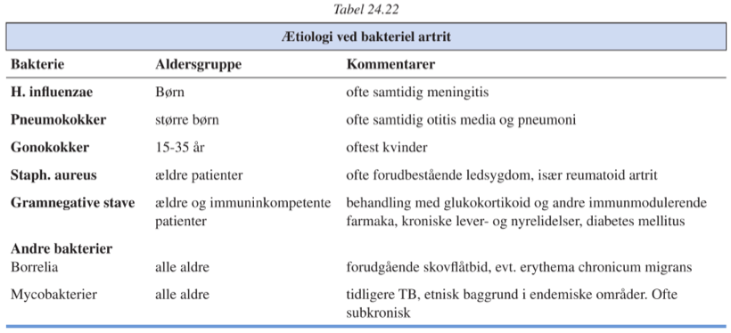

[TOC]

# Infektionsrelaterede artritter `407-415`

|              | Infektiøs artrit      | Reaktiv artrit          |
| ------------ | --------------------- | ----------------------- |
| Mono/poly    | Mono                  | Poly                    |
| Akut/kronisk | Akut                  | Akut (sjældent kronisk) |
| Agens        | I led (påvises i 80%) | Udenfor led             |

## Infektiøs artrit

### Bakteriel artrit

`Bakteriel ledbetændelse | pyogen artrit | septisk artrit`

Oftest i pt. der har generel eller lokal immunsuppresion.

Diagnosticeres ofte sent i pt. der enten har haft tidligere antibiotisk beh. eller immunsupprimerende (pga. RA grundmorbus el. lign).

Diagnosticeres ved ledaspiration.

Ved svært tilgængelige led kan CT- eller MR-scanning være en stor hjælp.

Behandling er 

1. Antibiotika
2. Tømning af ledvæske
3. Immobilisation, så længer der er aktivitet.

#### Særlige former for bakteriel artrit

Ikke synderligt hyppige eller med ret specielle manifæstationer.

### Infektiøs spondylitis

`Septisk spondylitis | spondylitis pyogenes | vertebral osteomyelitis`

Pyogen infektion af coropora med medfølgende rygsmerter.

Smerterne kan have radikulært præg ved nerveaffektion.

Ved medfølgende sepsis ses septiske symptomer.

Giver oftest markante parakliniske infektionsparametre.
​	Der kan ses forøget basisk fosfatase, hypercalcæmi er ualmindeligt.

|                  | Myelomatose | Cancer-metastaser | Infektiøs spondylitis |
| ---------------- | ----------- | ----------------- | --------------------- |
| Basisk fosfatase | +++         | +++               | +                     |
| M-komponent      | +           | -                 | -                     |

DDX typisk via inflammationsmarkører, basisk fosfatase kan være vejledende, endelig diagnose på aspiration.

## Reaktive artriter – se "reaktive artritter"

#### 