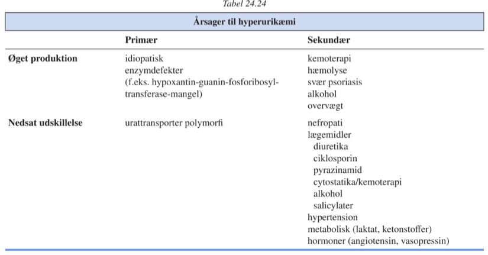

[TOC]

# Krystalsynovitis `422-427`

## Artritis urica

`Urinsyregigt | Ægte gigt | Podagra | Gout`

Årsager til hyperurikæmi:

Hyppig debut er akut/subakut forløb opstående om natten med voldsomme smerter, hævelse og ømhed.

5-10% udvikler kronisk polyarthrit.

Uratsænkende behandling er indiceret ved:

1. Mere end 2 anfald urinsyregigt
2. Persisterende hyperurikæmi