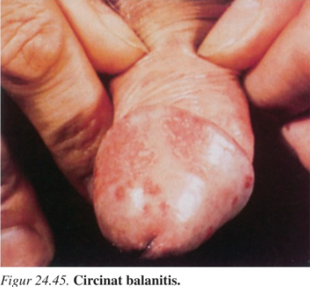
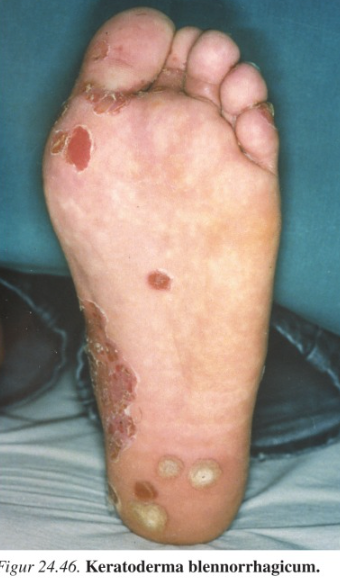
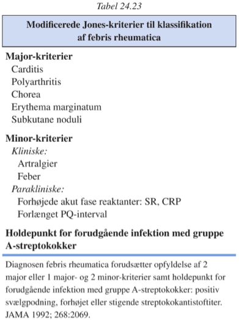

[TOC]

# Reaktiv artrit `415-422`

`Postinfektiøs artrit | Reactive arthritis`

Debutter typisk 1-3 uger efter infektion, oftest en GI- eller UVI.

Oftest en asymmetrisk oligoartrit, især UE-led.

Der ses ekstraartikulære manifæstationer især i hud, slimhinder og enteser.

Dactylitis ses kun ved Reiters syndrom eller psoriasisartrit.

~40% får balanitis circinata, der er indolent.

15% får keratoderma blenorrhagicum.

Klinisk og histologisk kan det være uadskilleligt fra psoriasis.

Størstedelen har så voldsomt et forløb at de er uarbejdsdygtigte i uger eller måneder.

Op til 40% har recidiv.

Reiters syndrom bør inducerer HIV-testning.

## Febris rheumatica

`Gigtfeber | Rheumatic fever`

## Mycobakterierelateret reaktiv artrit

## Virusartrit

Ofte symmetrisk, ofte store og små led på OE.

Generelt ikke kroniske.

### HBV-relateret artrit

Ses præikterisk, svinder ved udvikling af ikterus.

Kan være IgM-rheumafaktor positiv, diagnosticeres på HBsAg-positivitet.

### HBC-relateret artrit

Aldrig erosiv, 50% er RM-psoitive. Også andre autoantistoffer ses.

Kan være vanskelig at skelne fra RA, indikationer på RA er:

1. Veludtalt synovitis
2. Anti-CCP
3. Radiologisk påviselige erosioner

### Rubellavirus-artrit

Migrerende, polyartikulær symmetrisk.

Let diagnose når den ses sammen med udslettet.

Diagnosticeres ellers på stigende antistoffer i blodet.

### Parvovirus-artrit

### HIV-relateret artropati

### Andre virale artritter