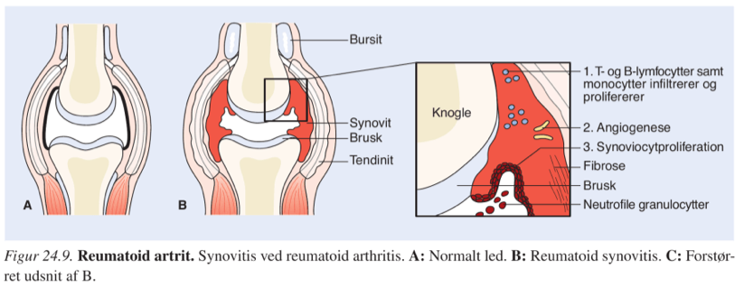
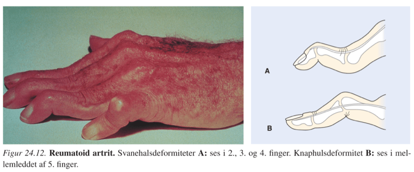
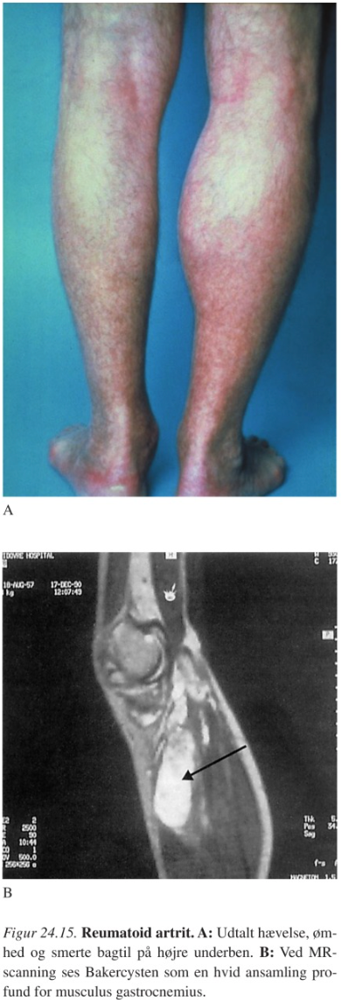
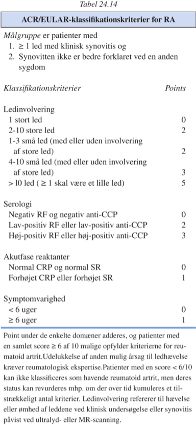

[TOC]

# Reumatoid artritis `372-396`

`Artrhitis rheumatoides | RA | Kronisk leddegigt | rheumatoid arthritis`

Perifær symmetrisk affektion af led, ekstraartikulære og systemiske manifæstationer.

Over tid destruktion af led og øget mortalitet.

## Patogenese

Nærmest alle typer kronisk inflammatorisk respons, både allergisk, T- og B-cellemedieret – især dysregulering af både kondroblaster og osteoklaster etc.

Neutrofile granulocytter ses primært i synovialisvæsken, kun i lav grad i synovialismembranen (hvis inflammerede, tumorlignende status kaldes pannus).

Også histaminergt, frigivelse af leukotriener etc.

Derfor både:

* Bursitis
* Synovitis
* Tendenitis

Ses også i interne organer og karvæggene.

## Kliniske manifæstationer

Kan være både snigende og akut/subakut.

|                   | MCP/MTP | PIP  | DIP  |
| ----------------- | ------- | ---- | ---- |
| Psoriasisartrit   | -       | -    | ++   |
| Rheumatoid artrit | +++     | +    | -    |

Typisk symmetriske og ved 80% polyartikulære ved sygdommens debut.

Muskelatrofi og muskelsvaghed ses hurtigt.

### Artikulære og periartikulære manifæstationer

Inflammationssymptomer, dernæst gradvis erosion der giver fejlstillinger og funktionsnedsættelser.

Desuden muskelatrofi og osteoporose.

#### Ledsymptomer

* Stivhed (især om morgenen, bedres med aktivitet)
* Smerter 
* Funktionsnedsættelse

Klinisk fund som ved inflammation, rødme er dog usædvanligt og tyder på infektion.

Rammer sjældent columna thoracolumbalis og sacroiliacaleddene.

#### Tenosynovitis og bursitis

Længerevarende kan der ses granulationsvæv der vokser ind i senerne med risiko for ruptur.

#### Muskelatrofi

Højest sandsynligt pga. inaktivitet, indtager hurtigt i løbet af uger.

#### Osteoporose

Lokalt pga. immobiliering.

Globalt pga. systemisk inflammation, nedsat fysisk aktivitet og evt. systemisk glukokortikoid.

#### Karakteristiske regionale forandringer i bevægeapparatet

##### Hænder og håndled

Symmetrisk polyartritis i MCP og PIP.

Der kan ses karpaltunnelsyndrom sekundært til bursitis.

##### Albueled og skulderled

Inflammation med bevægeindskrænkning.

##### Knæled

Bakercyste: udposning af synovialis ned mellem m. soleus og m. gastrocnemius, kan give pseudoflebotrombosesyndrom ved ruptur.

Behandling er injektion af steroid, evt. punktur. Kirurgi er sjældent indiceret.

##### Ankler og fødder

Som ved hænder.

##### Columna

Nærmest kun cervikalt, især atlantoaxialleddet med svækkelse af lig. transversum og evt. fraktur og obliteration af dens axis.

Giver smerter, nedsat bevægelighed og ved ~1% neurologisk udfaldssymptomer.

##### Hofteled

Sjældent direkte afficeret, der kan ses bursitis.

##### Kæbeled

### Ekstrartikulære manifæstationer

Især hos seropositive pt. (Rheumafaktor/anti-CCP).

#### Almensymptomer

#### Noduli rheumatici

Sædvanligvis indolente og kan have alt fra blød til fast konsistens.

Typisk associeret til steder med tryk, eg. albue.

Bedres ikke på mtx-behandling.

Der findes kirurgisk eller glukokortikoid beh., men virker kun midlertidigt, hvorfor det kun er indiceret ved inficerede noduli.

#### Øjenmanifæstationer

15-20% af seropositive: Sekundær Sjögren.

##### Episcleritis

De inflammerede kar kan forskydes ift. sclera. Kræver ikke behandling.

##### Scleritis

Kar kan ikke forskydes og kan give uveitis, keratitis eller katarakt, kræver behandling.

#### Reumatoid vaskulit

##### Vaskulær palpabel purpura

Leukocytoklastisk.

##### Nekrotiserende

##### Endarteritis obliterans

Splinters.

#### Lunger og pleura

Sjældne, pleuritis, noduli, lungefibrose etc.

#### Kardielle manifæstationer

Meget sjælden.

#### Neurologiske

##### Trykneuropatier

Sekundært til bursitter og inflammation.

##### Polyneuropatier

Muligvis sekundært til vaskulitter.

#### GI

Primært sekundært til NSAID.

#### Renalt

Primært sekundært til nefrotoksiske farmaka, evt. sekundær amyloidose.

#### Feltys syndrom

#### Lymfeknudesvulst

Typisk i områder der drænerer synovitis.

#### Arthritis palindromica

#### Stills sygdom

## Paraklinik

### Biokemi

#### Blodprøver

Generelt markører som man vil forvente ved langvarig kronisk inflammation, derudover skal lever- og nyreaffektion monitoreres pga. kraftige lægemidler

| Prøve    | Ændring                  |
| -------- | ------------------------ |
| CRP      | ↑                        |
| HgB      | ↓                        |
| Albumin  | ↓                        |
| RF       | + (sens. 69%, spec. 95%) |
| ANA      | + (hos 80%)              |
| Anti-CCP | + (sens. 67%, spec. 85%) |

Anæmien er normocytær, normo- eller hypokrom

#### Urinanalyser

Primært indiceret til monitorering af bivirkninger.

#### Ledvæskeanalyser

Indiceret for at udelukke septisk artrit eller krystalartrit.

### Billeddiagnostik

#### Røntgen af led

Ikke specifikke forandringer, men diagnostisk vejledende. Bruges især til monitorering af forløb.

For beskrivelse af forandringerne, se `384-385`.

#### MR-scanning

Forandringer ses tidligere end ved rtg.

#### Ultralyd

Inflammation.

#### DEXA

Monitorering af BMD.

#### Knoglescintigrafi

Vejledende ddx til knoglemetastaser.

## Forløb og prognose

15-20%: Få måneders aktivitetsperioder, hernæst langvarig, ~permanent remission.

15-20%: Få måneders aktivitetsperioder, få måneders remission.

60-70%: Progredierende sygodm, enten langsomt eller stødvist.
​	Udviklingen af sygdommen sker hurtigt de første 2 år, dernæst langsommere i 4 år, og sidst langsomt.

## Diagnose

RF ses ved andre autoimmune sygdomme, og hos en del raske.

Anti-CCP har samme sensitivitet, men højere specificitet for RA.

## DDX

For ddx, se "artrit ddx.md".

### Systemiske bindevævssygdomme

Generelt ikke de ekstraartikulære manifæstationer.

#### SLE

Non-erosiv.

#### Mixed connective tissue disease

### Polymyalgia rheumatica

### Kæmpecellearteritis

Altid seronegativ, hyppigst oligoartrit.

### Virusassocierede reaktive artritter

Typisk forbigående artrit, overstået i løbet af uger.

Antistofbestemmelse kan være en hjælp.

### Krystalartrit

Kan blive polyartikulær, men forudgåes af længere perioder med recidiverende, akutte monoartritter.

Uratkrystaller i ledvæsken, seronegativ.

### Borreliaartrit

Adskilles på serum og/eller tidligere flåtbid og hudmanifæstationer.

### Psoriasis-artrit

Ofte asymmetrisk.

Seronegativ, har ofte psoriatiske manifæstationer.

### HLA-B27 associerede artritter

Asymmetriske, især store led.

### Enteropatisk artropati

Oligoartrit, især store led.

Følger med tarmsygdommen.

### Spondylitis ankylopoietica

Dominerer i columna.

Oftest store led.

### Artrit associeret med malign sygdom

Clubbing og en primærtumor.

### Hyperlipoproteinæmi

Sjældnere, seronegativ.

### Osteoarthrosis polyarticularis

Ikke MCP, oftest PIP og DIP.

## Behandling

### Farmakologiske

#### Algoritme `391`

#### Analgetika

#### NSAID

#### DMARD

#### Biologiske terapier

#### Glukokortikoid

##### Systemisk

##### Intraartikulært/-bursært/-seneskede

### Ikke-farmakologiske

#### Information

#### Ergoterapi

#### Fysioterapi

#### Kostændringer

#### Kirurgi 

#### Rehabilitering

#### Revalidering

### Komplikationer

#### Reumatoid vaskulit

#### Endarteritis obliterans

#### Nekrotiserende vaskulitis

Indicerer akut forøgelse i behandling.

#### Feltys syndrom

#### Synoviale cyster

#### Reumatoide noduli

#### Pulmonale manifestationer

#### Øjenmanifestationer

#### Renale manifestationer

#### Sekundær amyloidose

### Behandling under graviditet