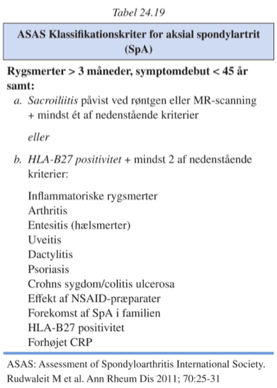
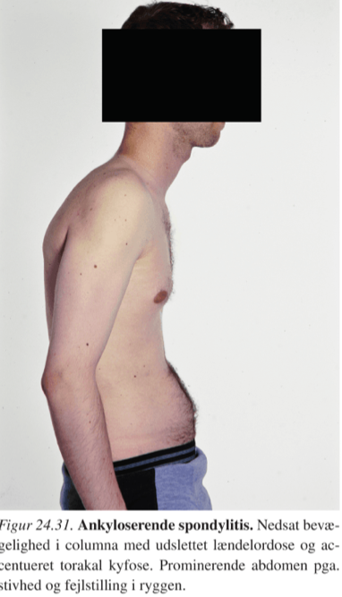
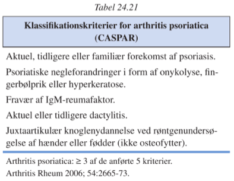

[TOC]

# Spondylartritis `397-403`

I varierende grad columna, også ofte perifære led.

Der kan også ses ekstraskeletale manifæstationer (øjne, hjerte, hud, lunger.

Hyppigst:

1. Rygsmerter
2. Perifær artropati (hyppigst asymmetrisk oligoartrit, især i underekstremiteterne)
3. Fravær af autoimmunitetsmarkører (IgM-rheumafaktor, anti-CCP, ANA)

Vanskelige at adskille tideligt i forløbet.

## Ankyloserede spondylitis

`Mb. Bechterew, AS | Spondylitis ankylopoeitica | Marie-Strümpells syndrom | Pelvosponditis ossificans`

Rammer især columna og sacroiliacaled, ofte også andro store led.

Stærkt associeret til HLA-B27 (90% af pt., kun 9% af normalbefolkningen).

Diagnostik via ASAS-kriterierne (Sens 80%, spec 85%).

Giver knogleerosion og halisterese.

Vil også give kalcifikationer i kanten af anulus fibrosus med dannelse af "knoglebroer", syndesmofytter.

Rygsmerter debutsymptom hos 75%.

Smerterne **forværres i hvile** og er værst **om natten**, med morgenstivhed. Bevægelse hjælper.

Ingen sensoriske eller motoriske udfald.

### Paraklinik

Inflammatoriske forøgelser, mange har også forøget P-IgA.

Ingen forøgelse af autoantistoffer.

Næsten altid HLA-B27.

Radiologiske forandringer i led.

MR-scanning særdeles anvendelig initielt.

## Psoriatrisk arthritis

`Arthritis psoriatica | Psoriasisgigt `

Kan ramme alle led i alle konfigurationer, tendens til affektion af DIP-led.

Diagnosticeres via CASPAR-kriterierne med spec. 0,99 og sens 0,91.

DIP-artrit associeret til psoriatriske negleforandringer, ellers ikke associeret til hudlidelsen.

Hyppigst asymmetrisk oligo- eller monoartrit, dog meget dårlig diagnostisk.

Generelt et mere benignt forløb end RA.

### DX og DDX

|                    | Rheumafaktor | Spondylartritis | Ledforandringer         |
| ------------------ | ------------ | --------------- | ----------------------- |
| Psoriatrisk artrit | +            | 30%             | Erosioner og nydannelse |
| Rheumatoid artrit  | -            | ~0%             | Kun erosioner           |

## Reaktive artritter (AS)

## Enteropatisk artropati (PsA)

## Udifferentieret spondylartrit (uSpA)