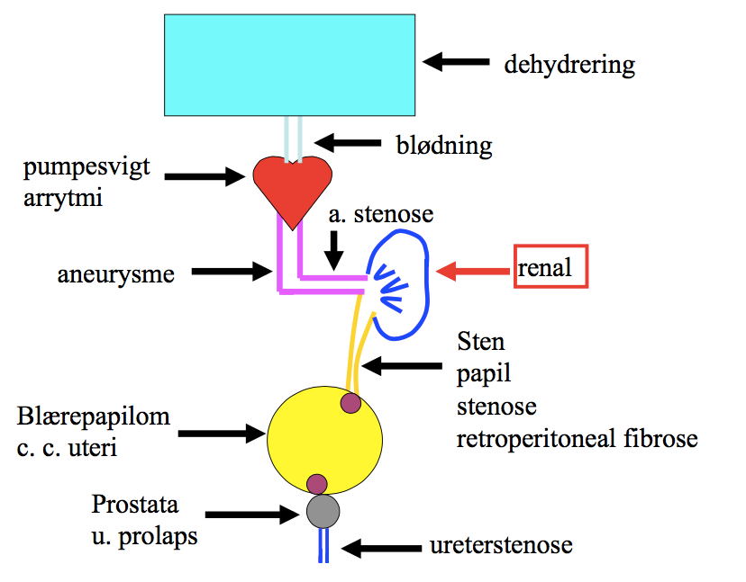

[TOC]

# Undersøgelser, akut nyresvigt

Ang-II er vasokontraherende på efferent arteriole -> øger FF.

Diabetes kan give forøgelse i GFR.

ACE-hæmmere -> akut fald i GFR (hæmmer Ang-II på eff. art.)
​	Dog stadig beskyttende (årsag?)

Ved opstart af ACE-hæmmere og dernæst voldsomt fald i GFR -> OBS: Nyrearteriestenose.

Ved pt. med abnorm muskelmasse er eGFR upålidelig. Erstatning: Kreatinin-clearance (overestimerer nærmest altid).

Ved akut totalt nyresvigt når P-kreatinin først over normalområdet efter ca. et døgn
​	Brug diurese

